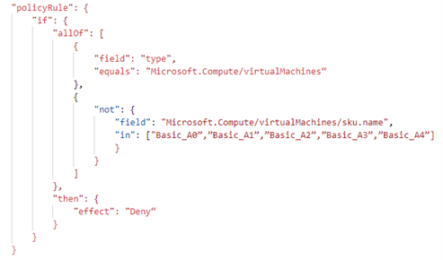
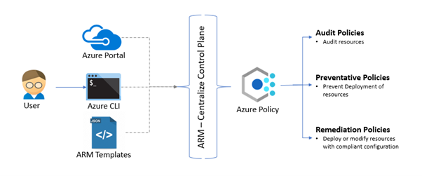

In today’s world Cloud becoming so popular among many businesses due to its wide sets of features like as it is agility, speed, scalability, and reliability, etc. Though cloud has humongous potential to change how different  business operates, it has some downsides too if not handled or governed properly.

In a cloud world, it is very easy to provision 1000 virtual machines or storage accounts with just a click of a button within 5-10 minutes. However, it is also important to focus on who has the access to resources? who is creating and using them? what are the security configurations present on them? what if resources provisioned are not able protect the data present inside properly? what will be cost if somebody accidentally creates 10000 resources?

There are lots of things we need to consider while using the cloud such as Access Management, Security, Cloud spend that have considerable impact on the business and how it operates. In fact, [Gartner](https://www.gartner.com/smarterwithgartner/is-the-cloud-secure/) estimated that **“Through 2025, 99% of cloud security failures will be the customer’s fault”**.

To fully make use of the cloud efficiently and securely, one must consider the two most important pillars i.e. **Cloud Governance and Security**. To manage the cloud environment properly, one must adhere to some practices or policies which will help their businesses to operate smoothly and securely.

What drives your need for policy enforcement?
   - Maintain security and performance consistency
  - Regulatory Compliance
  - Enforce enterprise-wide design principles
  - Controlling cost

Different business has different needs to apply policies as few of them stated above. Azure provides the **Azure policy framework** that helps users to handle all the needs of governance and security.

Let us see what Azure Policy is and how it works.

## What is Azure Policy?

Azure Policy is created to assess and enforce enterprise-wide governing standards on large Azure environments. The Azure policy is free services from Azure which help to set up different policies, assign them at different scope like resources, resource groups, management groups. It provides the visibility around the compliant and non-compliant resources w.r.t to policies configured in the environment. It also helps to remediate the non-compliant resources.

The basic building block of Azure policy is Policy definition which describes the resource configurations checks and action to be taken case resource is non-compliant in JSON formatted code.

For example, the below policy helps to prevent the creation of virtual machines with basic A0 to A4 SKUs.

Here, Azure policy is in the form of condition and effect. **If block** contains different compliance conditions and **then block** contains the effect of the policy. There are different effects that are supported by Azure Policies like **Audit, AuditIfNotExists, Deny, DeployIfNotExists, Append, Modify,** etc.

Generally, Azure policies are differentiated into main 3 categories depending on the effect/actions of the policy.

-   **Audit Policies**
    The policy with **Audit** and **AuditIfNotExists** effect falls under this category. It just audits the resources for configurations and shows the compliant and non-compliant resources. For e.g. If you want to just audit all the VMs that do not use managed disks.
-   **Preventative Policies**
    The policy with the **Deny** effect considered as preventative policies. It helps to set up policies that do not allow resource creation if resources are not compliant with the checks of the policies. E.g. If you do not want to allow users to provision any resources in the West US region then you use the policy with Deny effect.
-   **Remediation Policies**
    The policies with **DeployIfNotExists**, **Append,** or **Modify** considered as remediation policies as it performs the remediation action in case resource is non-compliant. E.g. *“Deploy Log Analytics agent for
    Windows VMs”* policy deploys the log analytics agent whenever the user creates a windows VM within the Azure environment.

## How Azure Policy Framework Works?

Azure policy framework act as gatekeeper whenever the user performs provisioning or configuration change on Azure resources. The provisioning or configuration requests performed by the user using a portal, CLI, or ARM template deployments are going to ARM centralize control plane where all the policies which are
configured in Azure environments are evaluated against the resources in consideration. Depending on the evaluation results and effects of the policies necessary actions are taken on the resources like audit, prevent any resource from deployment or perform resource deployment to add compliant configurations.

## Different types of Governance Needs

Every organization has some best practices or policies around how to use, monitor or operate the assets present in the cloud or on-premises environment.

The organization has different types of policies or practices based on different needs. Let us see how the Azure policy framework helps to achieve below mentioned scenarios or needs.

### Operational Needs
To have good control on resources created in the cloud environment one must setup or enforce policies on naming conventions, tags to identify resources, control the resource creation boundary (say only east us deployment is allowed), or block the creation of certain resource types. The Azure policy will help you
to create wide sets of control to improve operational control.

Some examples of in-built Azure policies for the operational governance
-   Require a tag and its value on resource groups **[Preventative]**
-   Append a tag and its value from the resource group **[Remediation]**
-   Resource or resource group name should contain XYZ prefix as part of naming conventions **[Audit]**
-   Allowed region for deployments **[Preventative]**
-   Allowed Resource Types **[Preventative]**

### Cost management needs
Most of the cost management tools are monitoring the cloud spend or have budget alerts once the resources are created. However, with the help of Azure policy in-built checks governance team can control the cloud spend by limiting the provisioning of higher SKU resources.

Some examples of built-in Azure Policies for the cost management
-   Allowed storage account SKUs **[Preventative]**
-   Allowed virtual machine size SKUs **[Preventative]**
-   Azure VPN gateways should not use 'basic' SKU **[Preventative]**

### Business needs OR Compliance needs
Every business has its own compliance needs based on the domain they are in like healthcare, financial, retail, etc. The policies are applied to ensure that they are not violating the compliance needs that are required for GDPR, HIPAA, PCI DSS, or many more. For example, GDPR does not allow to store data outside
Europe. Using Azure policies, we can enforce the control which prevents resource creation outside the European region.

Some examples of built-in Azure policies for compliance needs,
-   MFA should be enabled on accounts with owner permissions on your subscription **[Audit]**
-   Allowed locations for resource groups **[Preventative]**
-   Azure Cosmos DB allowed locations **[Preventative]**
-   Azure Backup should be enabled for Virtual Machines **[Audit]**
-   SQL Database should avoid using GRS backup redundancy **[Preventative]**

The Azure policy provides built-in regulator compliances like Azure Security Center, CIS Microsoft Azure Foundation, HIPAA HITRUST 9.2, NIST SP 800-53 R4, NIST SP 800-171 R2

### Security needs
In the cloud world provisioning of resources with security configurations is important as misconfiguration most likely leads to security incidents or attacks. Protecting assets or customer data is very crucial. One must apply
strict policies or control to adhere to any compliance or regulatory standards and protect business or customer sensitive data from malicious actors. The Azure policy comes with a large set of security checks which helps to secure and protect cloud environments.

Some examples of built-in Azure policies which helps to audit or remediate non-compliant resources,
-   Secure transfer to storage accounts should be enabled [**Audit**]
-   Storage account should use customer-managed key for encryption **[Audit]**
-   Storage accounts should restrict network access **[Preventative]**
-   Disk encryption should be enabled on Azure Data Explorer **[Audit or Preventative]**
-   Network interfaces should not have public Ips **[Preventative]**
    Azure Cosmos DB accounts should have firewall rules **[Audit or Preventative]**

## Summary
I hope you enjoyed the article; There is a lot more to do with Azure Policy, I have tried to provide the gist of what Azure policy is and how you can govern and secure your cloud environments using it depending on organization governance need. Azure policy framework or service provides endless possibilities through
Azure custom policies and policy initiatives.

## Useful Resource Links:

-   [Azure Policy Overview](https://docs.microsoft.com/en-us/azure/governance/policy/overview)
-   [Azure Built-In Policies](https://docs.microsoft.com/en-us/azure/governance/policy/samples/built-in-policies)
-   [Azure Policy Samples](https://github.com/Azure/azure-policy)
-   [Manage Policy as Code](https://docs.microsoft.com/en-us/azure/governance/policy/tutorials/policy-as-code-github)
-   [Create custom policy definitions](https://docs.microsoft.com/en-us/azure/governance/policy/tutorials/create-custom-policy-definition)
-   [Contribute to Azure Policy Samples](https://github.com/Azure/Community-Policy)
-   [Regulatory Compliance](https://docs.microsoft.com/en-us/azure/governance/policy/samples/built-in-initiatives#regulatory-compliance)
